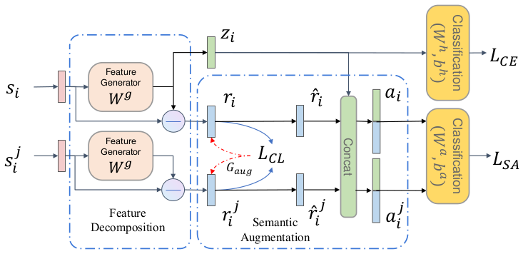

# DAPL





Code and datasets for the EMNLP2022 short paper [Reducing Spurious Correlations for Relation Extraction by Feature Decomposition and Contrastive Learning].


Requirements
==========

Please `pip install -r requirements.txt` before running.

Datasets
==========

We provide all the datasets and prompts used in our experiments.

+ [[SEMEVAL]](datasets/semeval)

+ [[KBP37]](datasets/kbp37)

+ [[TACRED]](datasets/tacred)

The expected structure of files is:


```
FDCL
 |-- datasets
 |    |-- semeval
 |    |    |-- train.txt       
 |    |    |-- dev.txt
 |    |    |-- test.txt
 |    |    |-- label.json
 |    |-- kbp37
 |    |    |-- train.txt       
 |    |    |-- dev.txt
 |    |    |-- test.txt
 |    |    |-- label.json
 |    |-- tacred
 |    |    |-- train.txt       
 |    |    |-- dev.txt
 |    |    |-- test.txt
 |    |    |-- label.json
 
```


Run the experiments
==========

# Download pretrained BERT

You can run the following script to download pretrained BERT-base model.

```
mkdir bertmodel
wget -P bertmodel https://huggingface.co/bert-base-uncased/resolve/main/pytorch_model.bin
wget -P bertmodel https://huggingface.co/bert-base-uncased/resolve/main/vocab.txt
wget -P bertmodel https://huggingface.co/bert-base-uncased/resolve/main/config.json
```


# Run the program

You can run the training script after downloading the pretrained BERT by `./sample.sh`. Remember to modify the `--task_name` argument if you are not training with SemEval dataset. We record the best parameter selection of SemEval and KBP37 in `./train.sh`. It would take 25 mins to train on SemEval dataset and 70 mins on KBP37 dataset on a single TITAN RTX GPU. For TACRED dataset, we provide trained parameters with the best performance. You can download it from [google drive](https://drive.google.com/file/d/15Qaw_ccTl4AvR7kNuHJKAbBZe9Gnc69D/view?usp=sharing) and place it in `mymodel` folder, and then run `./test.sh` to test it.

